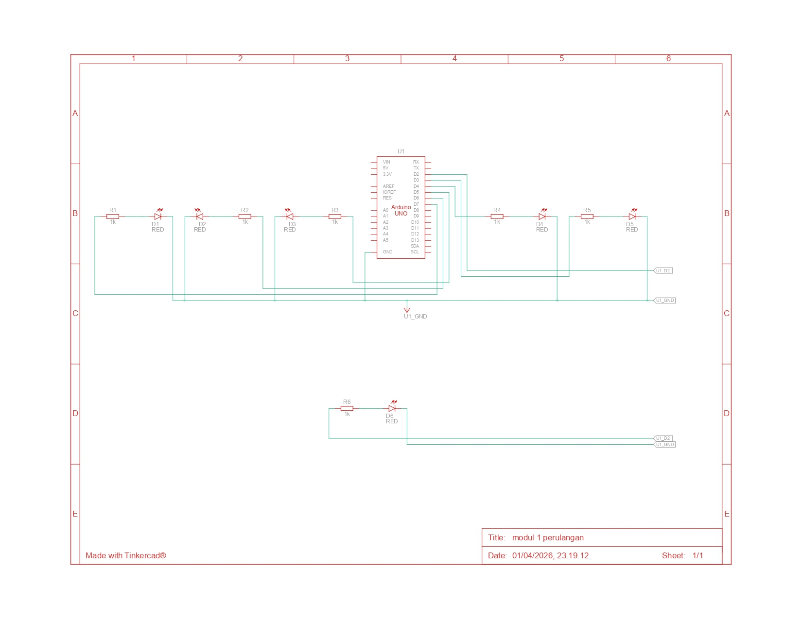

# Praktikum Sistem Tertanam - Modul 1 Perulangan

## Pertanyaan Praktikum
1. Gambarkan rangkaian schematic 5 LED running yang digunakan pada percobaan!
2. Jelaskan bagaimana program membuat efek LED berjalan dari kiri ke kanan!
3. Jelaskan bagaimana program membuat LED kembali dari kanan ke kiri!
4. Buatkan program agar LED menyala tiga LED kanan dan tiga LED kiri secara bergantian dan berikan penjelasan disetiap baris kode nya dalam bentuk README.md!

## Jawaban

### 1. Gambarkan rangkaian schematic 5 LED running yang digunakan pada percobaan!


### 2. Jelaskan bagaimana program membuat efek LED berjalan dari kiri ke kanan!
Program membuat efek LED berjalan dengan menggunakan perulangan `for` dari pin kecil ke pin besar, yaitu dari pin 2 sampai pin 7.
```
for (int ledPin = 2; ledPin < 8; ledPin++) {
  digitalWrite(ledPin, HIGH);
  delay(timer);
  digitalWrite(ledPin, LOW);
}
```
Pada setiap pengulangan, satu LED dinyalakan dengan `digitalWrite(ledPin, HIGH)`, lalu program menunggu selama `timer` milidetik. Setelah itu LED dimatikan kembali dengan `digitalWrite(ledPin, LOW)`. Karena LED menyala satu per satu secara berurutan dari pin 2 hingga pin 7, maka terlihat efek LED berjalan dari kiri ke kanan.

### 3. Jelaskan bagaimana program membuat LED kembali dari kanan ke kiri!
Program membuat LED kembali dari kanan ke kiri dengan menggunakan perulangan `for` dari pin besar ke pin kecil, yaitu dari pin 7 sampai pin 2.
```
for (int ledPin = 7; ledPin >= 2; ledPin--) {
  digitalWrite(ledPin, HIGH);
  delay(timer);
  digitalWrite(ledPin, LOW);
}
```
Pada bagian ini LED dinyalakan mulai dari pin 7, kemudian pin 6, pin 5, pin 4, pin 3, dan terakhir pin 2. Karena urutannya dibalik, maka LED terlihat bergerak kembali dari kanan ke kiri.

### 4. Buatkan program agar LED menyala tiga LED kanan dan tiga LED kiri secara bergantian
#### Source cOde
```
int timer = 500;
// delay. Semakin tinggi angkanya, semakin lambat waktunya.

void setup() {
  for (int ledPin = 2; ledPin < 8; ledPin++) {
    pinMode(ledPin, OUTPUT);
  }
}

void loop() {
  // tiga LED kiri menyala
  digitalWrite(7, HIGH);
  digitalWrite(6, HIGH);
  digitalWrite(5, HIGH);
  digitalWrite(4, LOW);
  digitalWrite(3, LOW);
  digitalWrite(2, LOW);
  delay(timer);

  // tiga LED kanan menyala
  digitalWrite(7, LOW);
  digitalWrite(6, LOW);
  digitalWrite(5, LOW);
  digitalWrite(4, HIGH);
  digitalWrite(3, HIGH);
  digitalWrite(2, HIGH);
  delay(timer);
}
```
#### Penjelasan
1. Inisialisasi variabel
```
int timer = 500;
```
Baris ini digunakan untuk menyimpan nilai jeda waktu sebesar 500 milidetik. Variabel `timer` berfungsi untuk mengatur lama perpindahan nyala LED. Semakin besar nilainya, maka perpindahan nyala LED akan semakin lambat.

2. Fungsi `setup()`
```
for (int ledPin = 2; ledPin < 8; ledPin++) {
  pinMode(ledPin, OUTPUT);
}
```
Bagian ini digunakan untuk mengatur pin 2 sampai pin 7 sebagai output. Artinya, semua pin tersebut disiapkan agar dapat digunakan untuk menyalakan LED.

3. Tiga LED kiri menyala
```
digitalWrite(7, HIGH);
digitalWrite(6, HIGH);
digitalWrite(5, HIGH);
digitalWrite(4, LOW);
digitalWrite(3, LOW);
digitalWrite(2, LOW);
delay(timer);
```
Bagian ini membuat tiga LED di sisi kiri menyala, yaitu LED pada pin 7, 6, dan 5. Pada saat yang sama, LED pada pin 4, 3, dan 2 dimatikan. Setelah itu program menunggu selama timer milidetik agar pola nyala terlihat jelas.

4. Tiga LED kanan menyala
```
digitalWrite(7, LOW);
digitalWrite(6, LOW);
digitalWrite(5, LOW);
digitalWrite(4, HIGH);
digitalWrite(3, HIGH);
digitalWrite(2, HIGH);
delay(timer);
```
Bagian ini membuat tiga LED di sisi kiri dimatikan, lalu menyalakan tiga LED di sisi kanan, yaitu LED pada pin 4, 3, dan 2. Setelah itu program kembali menunggu selama timer milidetik sebelum mengulangi pola yang sama.

### Kesimpulan
Program LED running bekerja dengan menyalakan LED satu per satu secara berurutan menggunakan perulangan for. Perulangan dari pin 2 sampai 7 membuat LED terlihat bergerak ke satu arah, sedangkan perulangan dari pin 7 sampai 2 membuat LED bergerak kembali ke arah sebaliknya. Untuk pola tiga LED kanan dan tiga LED kiri, program menyalakan tiga LED di satu sisi lalu mematikan sisi tersebut dan menyalakan tiga LED di sisi lainnya secara bergantian.