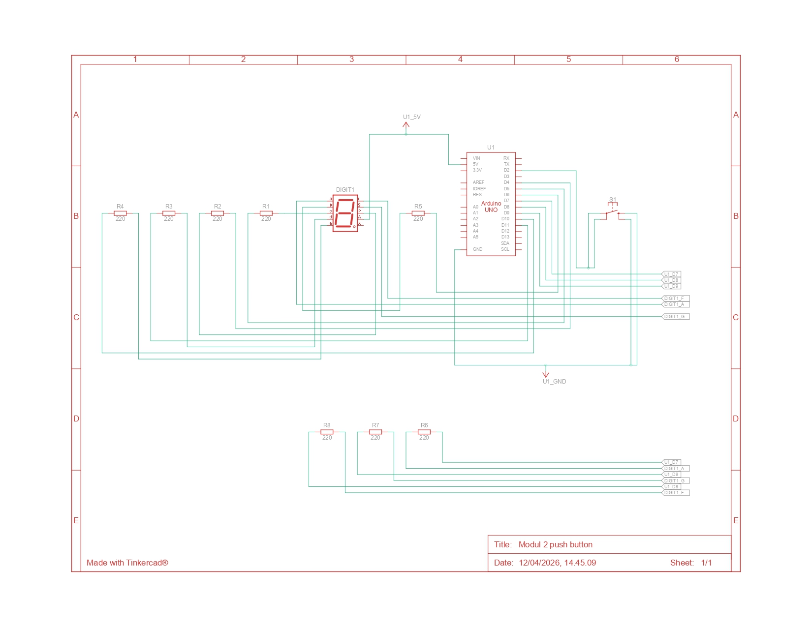
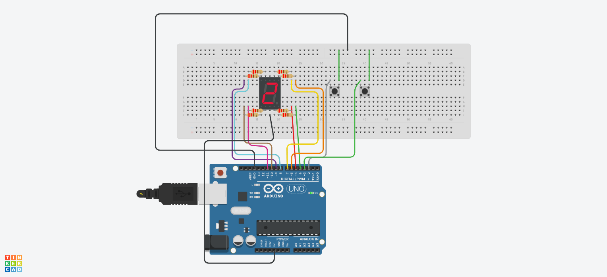

# Praktikum Sistem Tertanam - Modul 2 Push Button

## Pertanyaan Praktikum
1. Gambarkan rangkaian schematic yang digunakan pada percobaan!
2. Mengapa pada push button digunakan mode `INPUT_PULLUP` pada Arduino Uno? Apa keuntungannya dibandingkan rangkaian biasa?
3. Jika salah satu LED segmen tidak menyala, apa saja kemungkinan penyebabnya dari sisi hardware maupun software?
4. Modifikasi rangkaian dan program dengan dua push button yang berfungsi sebagai **penambahan (increment)** dan **pengurangan (decrement)** pada sistem counter dan berikan penjelasan disetiap baris kode nya

## Jawaban

### 1. Gambarkan rangkaian schematic yang digunakan pada percobaan!


### 2. Mengapa pada push button digunakan mode `INPUT_PULLUP` pada Arduino Uno? Apa keuntungannya dibandingkan rangkaian biasa?
Mode INPUT_PULLUP pada Arduino Uno digunakan untuk mengaktifkan resistor pull-up internal sehingga pin input secara default berada pada kondisi HIGH dan akan berubah menjadi LOW saat push button ditekan. Keuntungan penggunaan INPUT_PULLUP dibandingkan rangkaian biasa adalah:
- Tidak perlu resistor eksternal.
- Menghindari kondisi floating (tidak stabil) pada pin input
- Mengurangi noise atau pembacaan acak pada tombol.
- Wiring lebih mudah.

### 3. Jika salah satu LED segmen tidak menyala, apa saja kemungkinan penyebabnya dari sisi hardware maupun software?
Jika salah satu segmen pada seven segment tidak menyala, kemungkinan penyebabnya dapat berasal dari hardware maupun software.
#### a. Sisi hardware:
- Kabel jumper tidak terhubung dengan benar.
- Resistor tidak tersambung atau salah posisi di breadboard.
- Kaki seven segment salah mapping atau tidak sesuai pin.
- Seven segment rusak (LED mati).
- Pin common (VCC/GND) tidak terhubung dengan benar.
- Salah baris pada breadboard (tidak satu jalur).

#### b. Dari sisi software:
- Mapping segmentPins tidak sesuai dengan wiring.
- Nilai pada digitPattern salah.
- Logika tidak sesuai dengan jenis seven segment (common anode/cathode).
- Fungsi digitalWrite() tidak dipanggil dengan benar.

### 4. Modifikasi rangkaian dan program dengan dua push button yang berfungsi sebagai **penambahan (increment)** dan **pengurangan (decrement)** pada sistem counter!

```
/ ================= PIN =================
const int segmentPins[8] = {7, 6, 5, 11, 10, 8, 9, 4};
// a  b  c  d  e  f  g  dp

const int btnUp = 2;
const int btnDown = 3;

// ================= DATA =================
byte digitPattern[16][8] = {
  {1,1,1,1,1,1,0,0}, //0
  {0,1,1,0,0,0,0,0}, //1
  {1,1,0,1,1,0,1,0}, //2
  {1,1,1,1,0,0,1,0}, //3
  {0,1,1,0,0,1,1,0}, //4
  {1,0,1,1,0,1,1,0}, //5
  {1,0,1,1,1,1,1,0}, //6
  {1,1,1,0,0,0,0,0}, //7
  {1,1,1,1,1,1,1,0}, //8
  {1,1,1,1,0,1,1,0}, //9
  {1,1,1,0,1,1,1,0}, //A
  {0,0,1,1,1,1,1,0}, //b
  {1,0,0,1,1,1,0,0}, //C
  {0,1,1,1,1,0,1,0}, //d
  {1,0,0,1,1,1,1,0}, //E
  {1,0,0,0,1,1,1,0}  //F
};

// ================= VARIABEL =================
int currentDigit = 0;

bool lastUpState = HIGH;
bool lastDownState = HIGH;

// ================= FUNCTION =================
void displayDigit(int num)
{
  for (int i = 0; i < 8; i++)
  {
    digitalWrite(segmentPins[i], !digitPattern[num][i]); // common anode
  }
}

// ================= SETUP =================
void setup()
{
  for (int i = 0; i < 8; i++)
  {
    pinMode(segmentPins[i], OUTPUT);
  }

  pinMode(btnUp, INPUT_PULLUP);
  pinMode(btnDown, INPUT_PULLUP);

  displayDigit(currentDigit);
}

// ================= LOOP =================
void loop()
{
  bool upState = digitalRead(btnUp);
  bool downState = digitalRead(btnDown);

  // === INCREMENT ===
  if (lastUpState == HIGH && upState == LOW)
  {
    currentDigit++;
    if (currentDigit > 15) currentDigit = 0;
    displayDigit(currentDigit);
    delay(200);
  }

  // === DECREMENT ===
  if (lastDownState == HIGH && downState == LOW)
  {
    currentDigit--;
    if (currentDigit < 0) currentDigit = 15;
    displayDigit(currentDigit);
    delay(200);
  }

  lastUpState = upState;
  lastDownState = downState;
}
```

#### Penjelasan
1. Deklarasi Pin Segment dan Tombol
```
const int segmentPins[8] = {7, 6, 5, 11, 10, 8, 9, 4};
const int btnUp = 2;
const int btnDown = 3;
```
Baris ini digunakan untuk menentukan pin Arduino yang terhubung ke masing-masing segmen pada seven segment dan tombol input. Urutan pin pada array segmentPins mengikuti susunan segmen:
- pin 7 → segmen a
- pin 6 → segmen b
- pin 5 → segmen c
- pin 11 → segmen d
- pin 10 → segmen e
- pin 8 → segmen f
- pin 9 → segmen g
- pin 4 → dp (decimal point)

Selain itu:
- btnUp terhubung ke pin 2, berfungsi untuk menambah angka
- btnDown terhubung ke pin 3, berfungsi untuk mengurangi angka

2. Array Pola Digit (0–F)
```
byte digitPattern[16][8] = {
  {1,1,1,1,1,1,0,0}, //0
};
```
Array ini digunakan untuk menyimpan pola nyala segmen untuk menampilkan angka dan huruf heksadesimal dari 0 sampai F. `{1,1,1,1,1,1,0,0}` Artinya segmen a, b, c, d, e, dan f menyala, sedangkan segmen g dan dp mati, sehingga terbentuk angka 0.

3. Deklarasi Variabel
```
int currentDigit = 0;
bool lastUpState = HIGH;
bool lastDownState = HIGH;
```
Variabel `currentDigit` digunakan untuk menyimpan nilai karakter yang sedang ditampilkan pada seven segment. Nilai awalnya adalah 0, sehingga saat program dimulai tampilan awal adalah angka 0. Variabel `lastUpState` dan `lastDownState` digunakan untuk menyimpan kondisi tombol sebelumnya. Variabel ini berguna untuk mendeteksi kapan tombol baru saja ditekan, sehingga penambahan atau pengurangan angka hanya terjadi satu kali setiap tekan.

4. Fungsi `displayDigit()`
```
void displayDigit(int num)
{
  for (int i = 0; i < 8; i++)
  {
    digitalWrite(segmentPins[i], !digitPattern[num][i]); // common anode
  }
}
```
Fungsi ini digunakan untuk menampilkan satu karakter pada seven segment. Fungsi melakukan perulangan dari segmen a sampai dp, lalu mengirimkan logika ke masing-masing pin sesuai pola pada array `digitPattern`.

5. Fungsi `setup()`
```
void setup()
{
  for (int i = 0; i < 8; i++)
  {
    pinMode(segmentPins[i], OUTPUT);
  }

  pinMode(btnUp, INPUT_PULLUP);
  pinMode(btnDown, INPUT_PULLUP);

  displayDigit(currentDigit);
}
```
Fungsi ini dijalankan sekali saat Arduino pertama kali dinyalakan. Pada bagian ini semua pin yang terhubung ke seven segment diatur sebagai OUTPUT, karena pin tersebut digunakan untuk mengendalikan nyala LED pada setiap segmen pin tombol `btnUp` dan `btnDown` diatur sebagai `INPUT_PULLUP`, sehingga tombol akan bernilai HIGH saat tidak ditekan dan LOW saat ditekan. Setelah itu, fungsi `displayDigit(currentDigit)` dipanggil untuk menampilkan nilai awal, yaitu 0, pada seven segment.

6. Pembacaan Tombol pada Fungsi `loop()`
```
bool upState = digitalRead(btnUp);
bool downState = digitalRead(btnDown);
```
Baris ini digunakan untuk membaca kondisi tombol saat `upState` untuk  menyimpan status tombol UP maupun `downState` untuk menyimpan status tombol DOWN

7. Proses Increment
```
if (lastUpState == HIGH && upState == LOW)
{
  currentDigit++;
  if (currentDigit > 15) currentDigit = 0;
  displayDigit(currentDigit);
  delay(200);
}
```
Bagian ini digunakan untuk menambah nilai tampilan saat tombol UP ditekan. 

8. Proses Decrement
```
if (lastDownState == HIGH && downState == LOW)
{
  currentDigit--;
  if (currentDigit < 0) currentDigit = 15;
  displayDigit(currentDigit);
  delay(200);
}
```
Bagian ini digunakan untuk mengurangi nilai tampilan saat tombol DOWN ditekan.

9. Penyimpanan Status Tombol Terakhir
```
lastUpState = upState;
lastDownState = downState;
```
Baris ini digunakan untuk menyimpan kondisi tombol saat ini menjadi kondisi sebelumnya untuk perulangan berikutnya.
