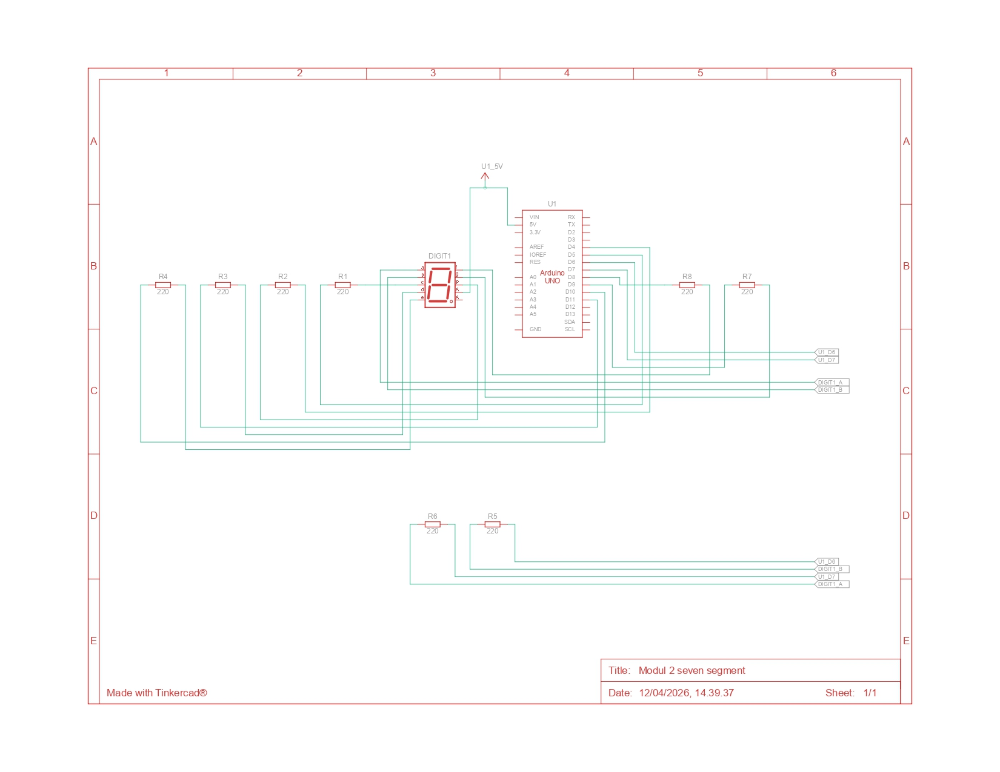

# Praktikum Sistem Tertanam - Modul 2 Seven Segment

## Pertanyaan Praktikum
1. Gambarkan rangkaian schematic yang digunakan pada percobaan!
2. Apa yang terjadi jika nilai `num` lebih dari 15?
3. Apakah program ini menggunakan **common cathode** atau **common anode**? Jelaskan alasanya!
4. Modifikasi program agar tampilan berjalan dari **F** ke **0** dan berikan penjelasan disetiap baris kode nya!

## Jawaban

### 1. Gambarkan rangkaian schematic yang digunakan pada percobaan!


### 2. Apa yang terjadi jika nilai `num` lebih dari 15?
Karena indeks yang valid hanya 0-15, maka ketika `num` labih dari 15 program akan mencoba mengakses data di luar batas array `digitPattern` yang mengakibatkan seven segment menampilkan pola yang salah atau acak, beberapa segmen bisa menyala tidak sesuai, dan program berpotensi menjadi tidak stabil.

### 3. Apakah program ini menggunakan **common cathode** atau **common anode**? Jelaskan alasanya!
Program sveen segment ini menggunakan **common anode**. Hal ini dapat dilihat pada baris:

```
digitalWrite(segmentPins[i], !digitPattern[num][i]);
```
Nilai pada tabel pola dibalik terlebih dahulu dengan operator `!` sebelum dikirim ke pin Arduino. Pada array `digitPattern`, nilai 1 berarti segmen seharusnya menyala dan nilai 0 berarti segmen mati. Namun karena nilainya dibalik, maka 1 akan menjadi 0 atau `LOW`, sedangkan 0 akan menjadi 1 atau `HIGH`. Jadi segment akan menyala saat pin diberi logika `LOW` dan mati saat `HIGH`. Ini merupakan ciri dari **common anode** yaitu kaki common-nya dihubungkan ke **VCC** atau **+5V**, sehingga segmen akan aktif ketika pin kontrol ditarik ke `LOW`.

### 4. Modifikasi program agar tampilan berjalan dari **F** ke **0**!
```
 // Pin mapping segment
const int segmentPins[8] = {7, 6, 5, 11, 10, 8, 9, 4};
// a  b  c  d  e  f  g  dp

// Segment pattern for 0-F
// urutan segmen: a b c d e f g dp
byte digitPattern[16][8] = {

{1,1,1,1,1,1,0,0}, //0
{0,1,1,0,0,0,0,0}, //1
{1,1,0,1,1,0,1,0}, //2
{1,1,1,1,0,0,1,0}, //3
{0,1,1,0,0,1,1,0}, //4
{1,0,1,1,0,1,1,0}, //5
{1,0,1,1,1,1,1,0}, //6
{1,1,1,0,0,0,0,0}, //7
{1,1,1,1,1,1,1,0}, //8
{1,1,1,1,0,1,1,0}, //9
{1,1,1,0,1,1,1,0}, //A
{0,0,1,1,1,1,1,0}, //b
{1,0,0,1,1,1,0,0}, //C
{0,1,1,1,1,0,1,0}, //d
{1,0,0,1,1,1,1,0}, //E
{1,0,0,0,1,1,1,0}  //F

};

// Fungsi menampilkan digit
void displayDigit(int num)
{
    for(int i=0; i<8; i++)
    {
        digitalWrite(segmentPins[i], !digitPattern[num][i]);
    }
}

void setup()
{
    for(int i=0; i<8; i++)
    {
        pinMode(segmentPins[i], OUTPUT);
    }
}

void loop()
{
    for(int i=15; i>=0; i--) 
    {
        displayDigit(i);
        delay(1000);
    }
}
```
#### Penjelasan
1. Deklarasi Pin Segment
```
const int segmentPins[8] = {7, 6, 5, 11, 10, 8, 9, 4};
```
Baris ini digunakan untuk menyimpan nomor pin Arduino yang terhubung ke masing-masing segmen pada seven segment.
Urutan pin mengikuti susunan segmen:
- pin 7 → segmen a
- pin 6 → segmen b
- pin 5 → segmen c
- pin 11 → segmen d
- pin 10 → segmen e
- pin 8 → segmen f
- pin 9 → segmen g
- pin 4 → dp (decimal point)

2. Array Pola Digit (0–F)
```
byte digitPattern[16][8] = {
    {1,1,1,1,1,1,0,0}, //0
```
Array ini digunakan untuk menyimpan pola nyala segmen untuk menampilkan angka dan huruf heksadesimal. Artinya segmen a, b, c, d, e, f, menyala dan segmen g serta dp mati.

3. Fungsi `displayDigit()`
```
void displayDigit(int num)
{
    for(int i=0; i<8; i++)
    {
        digitalWrite(segmentPins[i], !digitPattern[num][i]);
    }
}
```
Fungsi ini digunakan untuk menampilkan satu karakter pada seven segment. Fungsi ini melakukan perulangan untuk setiap segmen (a sampai dp), kemudian mengirimkan logika ke pin Arduino berdasarkan pola pada array `digitPattern`. Karena menggunakan seven segment common anode, nilai pola dibalik dengan operator `!` sehingga segmen dapat menyala dengan benar.

4. Fungsi `setup()`
```
void setup()
{
    for(int i=0; i<8; i++)
    {
        pinMode(segmentPins[i], OUTPUT);
    }
}
```
Fungsi ini dijalankan sekali saat Arduino pertama kali dinyalakan. Pada bagian ini, semua pin yang terhubung ke seven segment diatur sebagai OUTPUT menggunakan `pinMode()`, karena pin tersebut digunakan untuk mengendalikan nyala LED pada setiap segmen.

5. Fungsi `loop()`
```
void loop()
{
    for(int i=15; i>=0; i--) 
    {
        displayDigit(i);
        delay(1000);
    }
}
```
Fungsi ini berjalan terus-menerus selama Arduino aktif. Di dalamnya terdapat perulangan yang menampilkan karakter dari **F** ke **0** dengan cara memanggil fungsi `displayDigit()`. Setiap karakter ditampilkan selama 1 detik menggunakan `delay(1000)`, sehingga menghasilkan tampilan yang berubah secara berurutan.